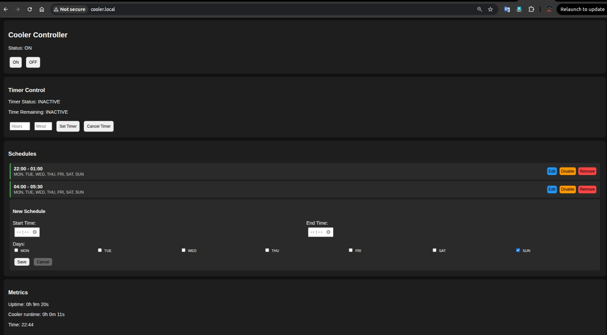

# CoolerOS
**ESP32 Cooler Controller** - A smart cooler controller with scheduling, timer, and web interface.

## Features

- **Manual Control**: ON/OFF buttons with absolute priority
- **Timer System**: Unlimited hours with precise timing (0-60 minutes)
- **Advanced Scheduling**: 
  - Max 10 schedules
  - Multiselect days (MON-SUN)
  - Start/end time with overnight support
  - Enable/disable functionality
  - Edit/delete individual schedules
  - Visual indication for schedules not active today
- **Priority System**: Manual > Timer > Schedule
- **Color-coded UI**: Green (today), Blue (other days), Gray (disabled)
- **Smart WiFi**: 15-second timeout with AP fallback for portable deployment
- **Accurate Runtime**: Shows exact run time without resets
- **Manual Override Protection**: Manual control respected until manual OFF

## Hardware

- ESP32
- Relay Module (5V)
- Button (optional for manual control)

## UI


## Setup

1. Install ESP32 board in Arduino IDE
2. Connect relay to pin 5
3. Upload code
4. Connect to WiFi via AP mode or auto-connect
5. Access web interface at ESP32 IP or http://cooler.local

## Web Interface

- **Dashboard**: Real-time status and controls
- **Timer**: Set duration with hours/minutes (unlimited hours)
- **Schedules**: Create, edit, delete schedules
- **Auto-refresh**: Updates every 3 seconds with pause during form input

## API Endpoints

- `/on` - Turn cooler ON
- `/off` - Turn cooler OFF
- `/set_timer` - Set timer (hours, minutes)
- `/cancel_timer` - Cancel active timer
- `/add_schedule` - Add new schedule
- `/remove_schedule` - Remove schedule
- `/toggle_schedule` - Enable/disable schedule
- `/status` - Get system status

## Schedule Format

```json
{
  "id": "unique_id",
  "startHour": 9,
  "startMinute": 0,
  "endHour": 17,
  "endMinute": 0,
  "days": [true, true, true, true, true, false, false],
  "enabled": true
}
```

## Priority Logic

1. **Manual ON/OFF** - Highest priority (absolute control)
2. **Timer Active** - Pauses schedules, expires on time
3. **Schedules** - Time and day based (respects manual override)

## Configuration

- **Max Schedules**: 10
- **Timer Max**: Unlimited hours
- **Auto-refresh**: 3 seconds
- **WiFi**: Auto-connect with 15-second timeout + AP fallback
- **Manual Override**: Until manual OFF (no time limit)
- **Runtime Tracking**: Accurate to the second

## Smart WiFi Features

- **Development Mode**: Connects to saved WiFi automatically
- **Production Mode**: 15-second timeout → AP fallback if WiFi unavailable
- **Portable Setup**: Creates "Cooler-Setup" hotspot for configuration
- **Dual Access**: Both WiFi setup and direct AP mode control
- **No Stuck Device**: Always accessible via hotspot

## Troubleshooting

- **Manual Control Issues**: Check that manual override is working (no auto turn-offs)
- **Timer Accuracy**: Timer expires exactly on time, no delays
- **Runtime Display**: Shows accurate time from first ON, no resets
- **WiFi Connection**: Try AP mode if WiFi unavailable
- **Schedule Conflicts**: Manual control always overrides schedules
- Check Serial Monitor for IP address
- Verify WiFi credentials
- Ensure relay connections
- Reset ESP32 if needed
